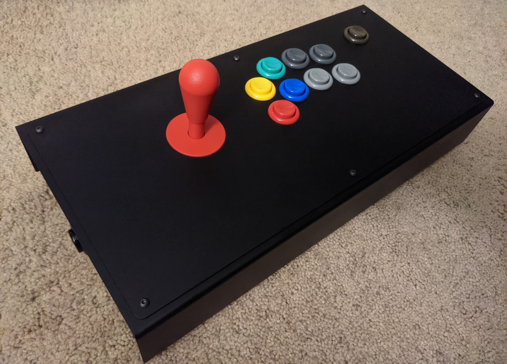

# USB-HID-Arcade-Stick

## Hardware
Arcade parts
- IL Eurojoystick
- 7x IL PSL (Concave) buttons
- 4x 'Generic Happ Style' Buttons
- 11x Cherry D44x 75g microswitches
- Neutrik NAUSB-W USB A to USB B coupler

Electrical
- [Teensy 3.2] (ARM Cortex-M4) Microprocessor
- 2.54mm pitch terminal blocks
- Electrocookie half-size prototyping pcb breadboard
- .187 quick release crimps and wires
- 2x 20 pin female headers

## Installation
If using a Teensy, the default installation will net you the `Bounce` library, which brings a Bounce() class that "debounces" the noisy signal generated from buttons opening/grounding a pin which would normally lead to unwanted registering of button presses. If on Arduino, head over to the [Bounce library] for installation instructions. 


To set up a custom manufacturer and product name, you will need to edit `boards.txt` located in e.g `hardware/teensy/avr/` and replace the vendorID and productID manually. It appears by default as so:
```
teensy31.vid.0=0x16C0
.
.
.
teensy31.pid.0=0x0483
.
.
.
```
Change the last four values e.g `0x0123` for each vid and pid. You can refer to a [USB ID registration database] and see what is not taken.

Then you will need to edit `usb_desc.h` located in e.g `hardware/teensy/avr/cores/teensy3`. You should edit the `VENDOR_ID` and `PRODUCT_ID` to be the same as what you put in `boards.txt`, and change the `LEN` of each. 
```
#elif defined(USB_HID)
  #define VENDOR_ID		0x16C0
  #define PRODUCT_ID		0x0482
  #define MANUFACTURER_NAME	{'T','e','e','n','s','y'}
  #define MANUFACTURER_NAME_LEN	6
  #define PRODUCT_NAME		{'J','o','y','s','t','i','c','k'}
  #define PRODUCT_NAME_LEN	8
```
That's all you really need to do to get a controller up and running. In the Arduino IDE, you'll need to select `Tools -> Board -> (Model)`   and     `Tools -> USB Type -> Keyboard + Mouse + Joystick` before compiling and uploading to your board.

Any unused buttons/axes/sliders/hats that reside in the usb descriptors can simply be ignored, since the data will just be empty. Generally, games that allow generic hid inputs allow you to customize controller binds.

If you are a bit annoyed to see extra stuff when running `joy.cpl` on Windows, then you can venture on to tinkering with the descriptors as well as the usb apis. This requires knowledge of USB Usage tables, as well as the size and packing of the data you are transmitting over USB. 

You will find an abundance of info in [this thread](https://forum.pjrc.com/threads/23681-Many-axis-joystick) over at the official PJRC forums. For an in depth guide to UDB HID Report Descriptors, visit [Frank Zhao's excellent blog post](https://eleccelerator.com/tutorial-about-usb-hid-report-descriptors/). 


[USB ID registration database]: (https://www.the-sz.com/products/usbid/)
[Bounce library]: (https://github.com/thomasfredericks/Bounce2)